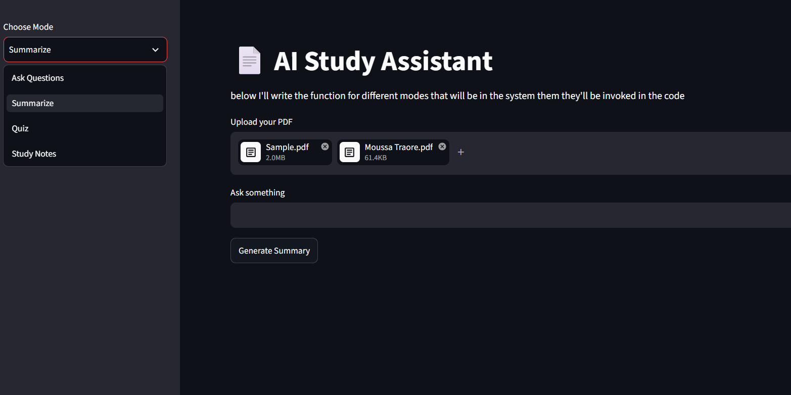

# AI Study Assistant

This project is an AI-powered study assistant that allows users to upload PDF documents and interact with their content using Retrieval-Augmented Generation (RAG).

The project started as a simple PDF question-answering MVP and is now being developed into a more complete study tool with multiple study modes.

## Features
📚 Document Processing
Upload multiple PDF documents
Extract text page by page
Preserve page and filename metadata
Split documents into smaller chunks

💬 Ask Questions
Ask questions about uploaded documents
Retrieve relevant document chunks
Generate answers using an LLM
Display the source pages used for the answer

📝 Study Modes
Generate summaries
Generate quizzes
Generate structured study notes

🎨 User Interface
Interactive Streamlit interface
Sidebar mode selection
Loading indicators
Source display
Wide layout for improved usability

## Tech Stack
- Python
- LangChain
- ChromaDB
- Streamlit
- OpenAI API
- HuggingFace Embeddings
- PyPDF

## Status
Work in progress (Week 2 - MVP)

## How It Works

This project uses Retrieval-Augmented Generation (RAG):

1. PDF documents are loaded and their text is    extracted.
2. Each page is converted into a document with metadata.
3. Documents are split into smaller chunks.
4. Each chunk is converted into an embedding using a HuggingFace model.
5. Embeddings and documents are stored in ChromaDB.
6. When the user makes a request, relevant chunks are retrieved.
7. The retrieved content is provided as context to the LLM.
8. The LLM generates the requested response.

## 📸 Screenshots

### Upload Interface

### Q&A Example

## 📌 Future Improvements
Better retrieval strategies
Persistent document storage
Chat memory
Better source citations
More advanced quiz generation
Flashcard generation
Improved UI/UX
Deployment

## ▶️ How to Run

Clone the repository:

git clone https://github.com/MOUSSA-TRAORE1/AI-Study-Assistant.git
cd AI-Study-Assistant

Create and activate a virtual environment:

python -m venv .venv

On Windows:

.venv\Scripts\activate

Install dependencies:

pip install -r requirements.txt

Create a .env file and add your OpenAI API key:

OPENAI_API_KEY=your_api_key_here

Run the application:

streamlit run streamlit_app.py

👤 Author
Moussa Traoré

Computer Engineering Student
Interested in Software Engineering, AI, and emerging technologies.