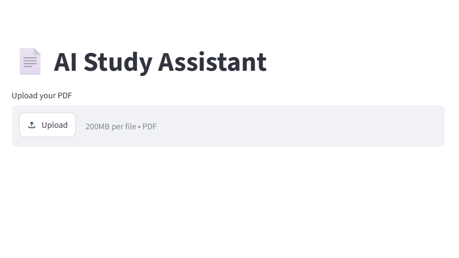
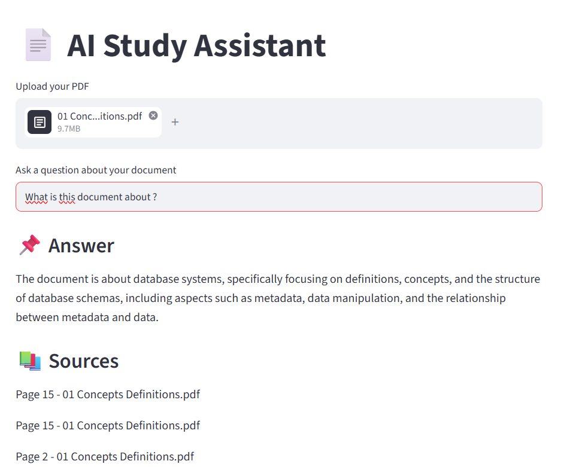

# AI Study Assistant

This project is an AI-powered assistant that allows users to upload PDFs and ask questions about their content.

## Features
- Upload PDF documents
- Ask questions about the document
- Get AI-generated answers
- Simple and interactive UI

## Tech Stack
- Python
- LangChain
- ChromaDB
- Streamlit
- OpenAI API

## Status
Work in progress (Week 1 - MVP)

## How It Works

This project uses Retrieval-Augmented Generation (RAG):

1. PDF is loaded and split into chunks
2. Chunks are converted into embeddings
3. Stored in a vector database
4. User question → relevant chunks retrieved
5. LLM generates answer based on context

## 📸 Screenshots

### Upload Interface


### Q&A Example



## 📌 Future Improvements
Chat memory
Multi-document support
Better UI
Deployment

## ▶️ How to Run

```bash
pip install -r requirements.txt
streamlit run streamlit_app.py
```

👤 Author
Moussa Traoré

